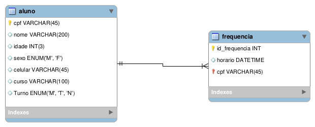

## Projeto Unificado - Registro de Frequência 

## [Faculdade Estácio de Sá](https://estacio.br/)

Análise e Desenvolvimento e Sistemas 

###### Projeto de extensão desenvolvido para registro de frequência de alunos da Autoescola Passagem Obrigatória.

Relativos aos Cursos:

Aplic. de Cloud, Iot e Indústria 4.0 em Python – Prof. Paulo Tadeu Peres Ingracio

Direito Cibernético – Prof. Bruno Macedo

Programação para Dispositivos Móveis em Android – Prof. Gabriel Rech Bau

Tópicos de Big Data em Python – Prof. Robson Lorbieski

### Backend: Python3, Flask, Plotly

### Frontend: React Native, Flask

##### Modelo entidade relacionamento:

[License](./LICENSE.md)
